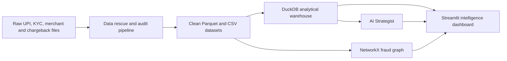

# AgentIQ FinTech

## UPI Fraud Ring & Merchant Risk Intelligence

[](https://www.python.org/)
[](https://streamlit.io/)
[](https://duckdb.org/)
[](https://groq.com/)

An enterprise analytics portal for monitoring UPI transaction health, merchant exposure, chargebacks, KYC risk, velocity anomalies, and suspicious payment networks.

## Run the project

Complete these three steps from the repository root.

### 1. Install the requirements

Python 3.10 or newer is required.

```bash
python -m pip install -r requirements.txt
```

Using a virtual environment is recommended:

```bash
python -m venv .venv
```

Activate it on Windows PowerShell:

```powershell
.\.venv\Scripts\Activate.ps1
python -m pip install -r requirements.txt
```

Activate it on macOS or Linux:

```bash
source .venv/bin/activate
python -m pip install -r requirements.txt
```

### 2. Create a Groq API key

The AI Strategist requires your own Groq API key.

1. Open the [GroqCloud API Keys page](https://console.groq.com/keys).
2. Create a free GroqCloud account or sign in.
3. Select **Create API Key** and copy the generated key.
4. Add your key to `.env`:

```text
GROQ_API_KEY=your-groq-api-key
```
The dashboard remains usable without a key, but live natural-language data analysis will be disabled.

### 3. Start the application

```bash
python app.py
```

The launcher prints the dashboard URL, normally `http://localhost:8501`. On the first run, it cleans the source data, builds the DuckDB warehouse, detects fraud rings, and launches Streamlit. Later runs reuse the generated outputs to avoid unnecessary rebuilds and database-lock conflicts.

Additional launcher options:

```bash
# Rebuild all data outputs, then launch the dashboard
python app.py --rebuild

# Rebuild all data outputs without launching the dashboard
python app.py --pipeline-only
```

Stop any running dashboard before using a rebuild option because DuckDB allows only one process to write to the warehouse file.

## What the dashboard provides

The sidebar gives access to six analysis workspaces:

1. **Executive KPIs** — network-wide volume, ticket size, failure rate, disputed volume, chargeback loss ratio, temporal heatmaps, and velocity anomalies.
2. **Merchant Risk Center** — merchant risk scoring, declared-versus-observed ticket analysis, category exposure, and the high-risk merchant league table.
3. **Fraud Ring Graph** — interactive NetworkX transaction topology, suspicious hubs, connected clusters, and transaction-flow tooltips.
4. **KYC & Identity Risk** — KYC status, customer risk segments, dispute ratios, and repeatedly disputed customers.
5. **AI Strategist** — twelve presets, natural-language questions, guarded text-to-SQL, Plotly visualizations, executive findings, and transparent SQL.
6. **Data Pipeline & Audit Proof** — raw-versus-clean row counts, retention metrics, transformation evidence, and per-table quality results.

## Evaluator checklist

| Requirement | Evidence |
| :--- | :--- |
| A clear README explaining how to run the project | The three-step [Run the project](#run-the-project) guide uses one final command: `python app.py`. |
| A data dictionary explaining every column | [`DATA_DICTIONARY.md`](DATA_DICTIONARY.md) documents all columns in the four cleaned datasets, including types, keys, meanings, and transformations. |
| Proof of data cleaning with raw and clean row counts | [`pipeline/clean_pipeline.py`](pipeline/clean_pipeline.py) calculates the audit metrics and generates [`data/processed/audit_proof.json`](data/processed/audit_proof.json). [`AUDIT_PROOF.md`](AUDIT_PROOF.md) provides the readable audit report. |

### Current cleaning audit

| Dataset | Raw rows | Clean rows | Duplicates removed | Unjustified drops |
| :--- | ---: | ---: | ---: | ---: |
| UPI transactions | 20,400 | 20,000 | 400 | 0 |
| KYC records | 36,400 | 28,920 | 7,480 | 0 |
| Merchant master | 6,210 | 4,343 | 1,867 | 0 |
| Chargebacks | 2,884 | 2,800 | 84 | 0 |
| **Total** | **65,894** | **56,063** | **9,831** | **0** |

The aggregate retention rate is **85.08%** after duplicate removal. The pipeline preserves every unique record and repairs malformed identifiers, currency values, timestamps, and missing fields instead of dropping affected rows.

Reproduce the cleaning evidence with:

```bash
python pipeline/clean_pipeline.py
```

## Architecture



| Layer | Technology | Purpose |
| :--- | :--- | :--- |
| Data rescue | Pandas, NumPy, PyArrow | Standardization, imputation, reconciliation, deduplication, and audit generation |
| Analytical warehouse | DuckDB | Star-schema tables, governed SQL views, aggregations, and KPI calculations |
| Fraud network | NetworkX | Directed transaction graph, connected clusters, and high-risk merchant hubs |
| Visual analytics | Streamlit, Plotly | Responsive dashboards, filters, tables, charts, and interactive graph exploration |
| AI Strategist | Groq, SQLGlot, DuckDB | Guarded read-only SQL generation, chart selection, and evidence-based findings |

## Data quality and governance

The cleaning pipeline follows a zero-lazy-drop policy:

- Standardizes user IDs, merchant IDs, transaction IDs, UTRs, MCC values, statuses, categories, and locations.
- Parses Unix epoch, ISO-8601, slashed, and 12-hour timestamp formats.
- Normalizes INR strings, currency symbols, comma separators, negative values, and `k` multipliers.
- Imputes missing customer income using occupation medians.
- Imputes missing merchant ticket sizes using category medians.
- Reconciles missing chargeback values and transaction MCCs through foreign-key lookups.
- Records raw rows, cleaned rows, duplicate counts, null counts, transformations, and aggregate retention in a JSON audit artifact.

See [`DATA_DICTIONARY.md`](DATA_DICTIONARY.md) for field definitions and [`AUDIT_PROOF.md`](AUDIT_PROOF.md) for the complete transformation evidence.

## AI Strategist safeguards

The AI Strategist uses a session-local in-memory DuckDB connection over the four cleaned datasets. Generated SQL is restricted to a single read-only query over approved tables and functions. External access, writes, recursive queries, sensitive identity fields, and unbounded output are blocked. Query execution has row, memory, and time limits.

Dashboard overview and capability questions are answered locally without SQL or a Groq call. Analytical questions use Groq for SQL generation and chart narration, then pass through local validation before execution or display.

## Project structure

```text
agentiq-fintech/
├── app.py                              # Main launcher: python app.py
├── run_all.py                          # Backward-compatible launcher
├── requirements.txt                    # Python dependencies
├── .env.example                        # Groq key template
├── README.md                           # Project setup and overview
├── DATA_DICTIONARY.md                  # Column definitions and transformations
├── AUDIT_PROOF.md                      # Human-readable cleaning evidence
├── track1_fintech_dataset_files/       # Supplied raw datasets
├── data/processed/                     # Generated clean data and audit outputs
├── pipeline/
│   ├── clean_pipeline.py               # Cleaning, rescue, and audit engine
│   ├── analytics_store.py              # DuckDB tables and analytical views
│   └── graph_detector.py               # NetworkX fraud graph generator
├── dashboard/
│   ├── app.py                          # Streamlit dashboard
│   ├── enterprise_theme.py             # CSS and Plotly design system
│   └── agent/
│       └── ai_strategist.py            # Guarded AI analysis workflow
├── test_ai_strategist.py               # AI and SQL safety regression tests
├── test_enterprise_ui.py               # Dashboard behavior regression tests
└── verify_dashboard.py                 # Data, view, and chart health checks
```

## Validation

Run the automated checks from the project root:

```bash
python -m unittest test_ai_strategist test_enterprise_ui -v
python verify_dashboard.py
```

The tests use controlled Groq responses, so they do not consume API quota. A live Groq key is required only for interactive AI Strategist analysis.

## Deployment

For a quick hosted demonstration, deploy `dashboard/app.py` on [Streamlit Community Cloud](https://streamlit.io/cloud) and add `GROQ_API_KEY` through the platform's secret settings. Make sure the processed data artifacts are available in the deployed repository or generated during deployment.

